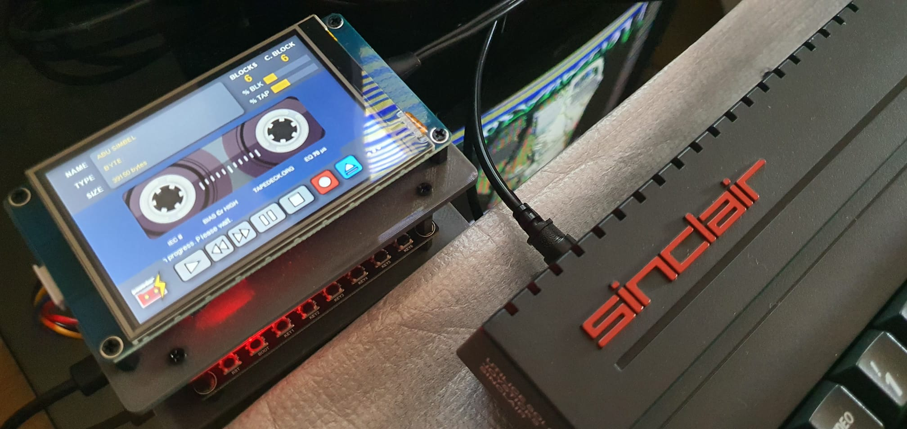
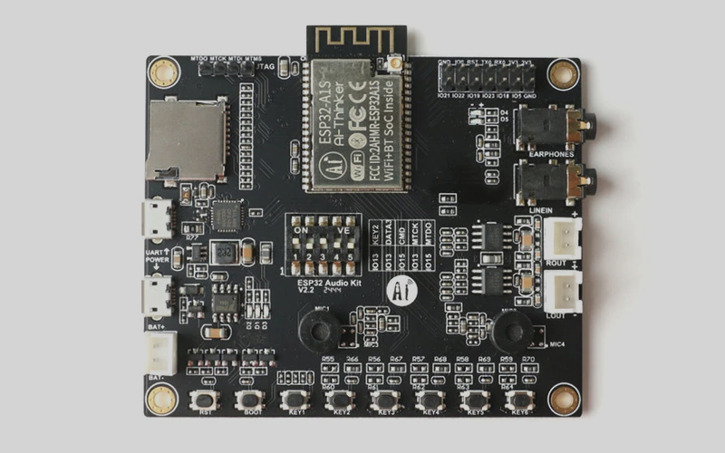
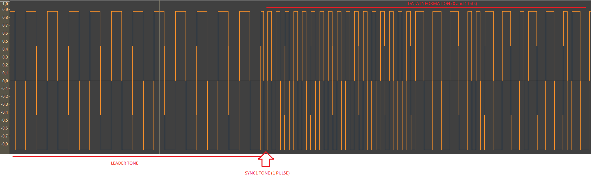

# POWADCR
Grabadora digital en formato TAP/TZX para ordenadores de 8 bits
-----

Este proyecto pretende implementar una grabadora digital (para reproducir ficheros TAP/TZX y grabar archivos en ficheros TAP) para máquinas ZX Spectrum, ZX Next y N-Go y clones compatibles, basada en la placa de desarrollo AudioKit ESP32 y usando una pantalla HMI tactil de 3,5".

Ésta placa que se muestra a continuación, ESP32 Audio Kit fabricada por AI-Thinker Technology, va equipada con un microcontrolador ESP32 v3 y un procesador de audio ES8388 y que sirve para éste propósito.

https://docs.ai-thinker.com/en/esp32-audio-kit

El resumen de especificaciones es el siguiente:
+ CPU 32 bits a 240 MHz
+ 512 KB + 4 MB de SRAM (PSRAM disponible)
+ 2 Núcleos
+ Procesador de audio dedicado ES8388
+ Entrada/salida de audio
+ Bluetooth
+ WiFi
+ 8 botones de conmutación
+ Conectores de E/S
+ Ranura SD
+ Módulo de carga de baterías LiPo

Es una placa de desarrollo con grandes posibilidades, aunque el uso al que se enfocaba era muy distinto al que se propone este proyecto. 

Para empezar es necesario utilizar las librerías de Phil Schatzmann para ESP32 Audio Kit v.0.65 (https://github.com/pschatzmann/arduino-audiokit) donde podremos aprovechar todos los recursos de este kit, para crear un reproductor y grabador digital para ZX Spectrum fácilmente, o esta es la primera idea.

Este proyecto necesita configurar los interruptores pintegrados en la placa de la siguiente manera :
|Switch|Valor|
|---|---|
|1|On|
|2|On|
|3|On|
|4|Off|
|5|Off|

## Pantalla LCD

La pantalla táctil LCD elegida para este proyecto es de la marca TJC. Es un módulo de pantalla LCD TFT HMI tactil compatible Nextion que se conecta con 2 pines seriales (TX y RX) a la placa.
+ Marca: TJC
+ Modelo: TJC4832T035_011
+ Tamaño: 3,5".
+ Resolución: 480x320.

Para que este tipo de pantalla funcione debe generarse un proyecto con una aplicación propia de la marca de ésta pantalla. Al ser una pantalla compatible con Nextion el funcionamiento es idéntico a la pantalla original. Los proyectos funcionan igual, pero solo es posible abrir con la aplicacion USART HMI de TJC los proyectos que hayan sido generados por esta misma aplicación. No es posible abrir proyectos de Nextion con la aplicación de TJC ni abrir proyectos de TJC con la aplicación original de Nextion aunque en el fondo se trata de la misma aplicación. Han querido hacer los editores HMI incompatibles entre sí aunque una vez compilados el fichero TFT resultante se puede instalar indistintamente en una pantalla TJC o Nextion.

Actualmente la aplicación USART HMI de TJC sólo se encuentra en Chino, mientras que la aplicación original de Nextion está en Inglés.

Proceso de carga en Sinclair ZX Spectrum
-----
Recomiendo el sitio web de Alessandro Grussu con información interesante sobre el proceso de carga y el tiempo de procesamiento para este objetivo. Éste es el Link de su página : https://www.alessandrogrussu.it/tapir/tzxform120.html#MACHINFO

Ahora, me gustaría mostrarles cómo la señal generada a partir del archivo TAP que Sinclair ZX Spectrum puede entender. El mecanismo para leer la señal de audio se basa en el conteo de picos de onda cuadrada, utilizando el tiempo de reloj Z80, luego:

La secuencia para ZX Spectrum, es siempre para carga estándar:

+ TONO GUÍA + SYNC1 + SYNC2 + BLOQUE DE DATOS + SILENCIO

Donde: TONO GUÍA (2168 T-States) tiene dos tipos de longitud.

+ Grande (x 8063 T-States) para el bloque "PROGRAMA" típico (BASIC)
+ Corto (x 3223 T-States) para el bloque "BYTE" típico, código máquina de Z80.

**¿Qué significa T-State?**

Éste concepto puede ser difícil de entender, pero no está lejos de la realidad, ya que resumido, un pulso completo (dos picos, uno alto y otro bajo) tiene un período igual al tiempo "2 x n T-State", donde T-State = 1/3,5 MHz = 0,28571 us, por ejemplo: TONO GUÍA GRANDE.

+ TONO GUÍA = 2168 x 8063 T-States = 17480584 T-States
+ 1 T-State = 1 / 3,5 MHz = 0,28571 us = 0,00000028571 s
+ Duración del TONO GUÍA = 17480584 x 0,00000028571 s = 4,98 s

**¿Cuántos picos tiene el tren de pulsos del TONO GUÍA GRANDE?**

+ El tren de pulsos tiene 2168 picos en ambos casos, pero el tono líder corto tiene una duración diferente (3223 estados T) en comparación con el tono líder grande (8063 estados T)

**¿Cuál es la frecuencia de la señal?**

+ Sabemos que el tren de pulsos del TONO GUÍA GRANDE dura 4,98 s
+ Sabemos que el tren de pulsos del TONO GUÍA CORTO dura 1,99 s
+ La frecuencia de ambos tonos líderes (2168 x 0,00000028571) / 2 = 809,2 Hz

Acerca del dispositivo POWADCR
-----
En esta sección describiremos las piezas necesarias para ensamblar el dispositivo PowaDCR.

Lista de materiales

+ Placa base: ESP32 Audiokit de AI-Thinker technology: https://docs.ai-thinker.com/es/esp32-audio-kit (Posible sitio de compra. Aliexpress)
+ LCD color de 3,5" 480x320 píxeles. Pantalla táctil resistiva - TJC4832T035_011 resistiva (de bajo precio pero posible descontinuación y sustitución por TJC4832T135_011C capacitiva o TJC4832T135_011R resistiva)
+ Cable XH2.5 a dupont para conectar el LCD al puerto extendido del ESP32 Audiokit
+ Batería 2000mAh 3.7v (opcional no necesaria)
+ Tarjeta micro SD formateada FAT32 (para contener todos los juegos del ZX Spectrum en formato TAP/TZX y otros formatos para ser utilizados en PowaDCR en el futuro)
+ Tarjeta Micro SD o interfaz serial FTDI FT232RL para programar el LCD TJC (ambos métodos están disponibles)
+ Cable con conectores estéreo-estéreo macho-macho de 3,5 mm para conectar PowaDCR a Spectrum Next o N-Go o versiones clónicas.
+ Cable con conector XH2.5 ó jack mono de 3,5 mm para conectar desde la salida del amplificador de PowaDCR al conector EAR en las versiones clásicas de ZX Spectrum (teclado de goma 16K, 48K, Spectrum+ y Spectrum 128K Toastrack). Los conectores Jack tanto para entrada o salida de la seña de ZX Spectrum son para señales de línea, mientras que los conectores XH2.5 son solo de salida y ésta está amplificada.
+ Versión del editor HMI en chino para editar el projecto de la pantalla : [http://filedown.tjc1688.com/USARTHMI/USARTHMIsetup_latest.zip]
+ Entorno Visual Studio Code con las extensiones C/C++, CMAKE y CMAKE Tools para editar los fuentes del proyecto y compilarlo.

Hackeando la placa ESP32 Audiokit
-----
Esta placa está construida a partir del mismo diseño de la versión con chip de audio AC101, pero con chip ES8388. En este caso, tanto el micrófono como la entrada de línea están mezclados. No es posible seleccionar de forma independiente el micrófono o la entrada de línea, ya que el ruido ambiental entra cuando se captura la señal del ZX Spectrum.

Por lo tanto, se deben quitar ambos micrófonos integrados, desoldándolos o bien arrancandolos con un alicate adecuado.

¿Cómo se conectan las piezas de PowaDCR?
-----
Para que la placa y la pantalla funcionen hay que instalar el firmware correspondiente antes de proceder a conectarlos entre sí, por lo que debéis saltar éste apartado y realizarlo una vez estén la placa y la pantalla lo tengan instalado.

En primer lugar voy a describir cómo deben conectarse los elementos descritos en la lista de materiales. Si es posible ésto debe hacerse en el orden que se indica aquí : 

+ Conectar el cable incluído con la pantalla HMI de 3,5 en el conector J1 de la pantalla.
+ Desde ese conector salen 4 cables que deben conectarse en el puerto serie o UART del Audio Kit. Es importante conectarlos correctamente ya que es posible que la placa o la pantalla puedan resultar dañadas. El conector UART de la placa está situado en la parte superior del ESP32 AudioKit (un connector tipo Dupont de 14 pines) y en el que solo vamos a usar la fila superior de ese conector. De estos 7 pines sólo vamos a usar 4 : GND, TX, RX y 3V3. Las conexión entre placa y pantalla debe realizarse según la siguiente tabla :

|Pantalla|Pin AudioKit|
|---|---|
|GND|GND|
|RX|TX|
|TX|RX|
|+5V|3V3|

Como se puede observar hay dos pines en la placa AudioKit marcados con 3V3. Cualquiera de los dos puede conectarse a los 5v del conector de la pantalla.

La placa de AudioKit internamente funciona a 3,3v por lo que se le está suministrando a la pantalla una tensión que no es la que corresponde porque la pantalla funciona a 5v. Ésto no afecta a su funcionamiento, pero en ocasiones puede producir un parpadeo que puede ser molesto.

Hackeando la pantalla HMI
-----
La pantalla por defecto, como se ha mencionado antes, trabaja con un voltaje de 5v. Para poder hacer que la pantalla trabaje exclusivamente a 3,3v hay que hacer una pequeña modificación : Hay que localizar cerca del conector J1 dos contactos marcados como JP2 en los que no hay conectado nada. El fabricante debía haber colocado un conector de Dupont de 2 pines para poder insertar un Jumper si se desea hacer que la pantalla trabaje a 3,3v o no. Si vamos a usar ésta pantalla exclusivamente para el POWADCR lo que debemos hacer es poner un punto de estaño uniendo esos dos contactos ya que los agujeros no están hechos y no es posible poner un conector para el Jumper. Una vez unidos los contactos comprobaremos que la placa no tiene ese parpadeo mencionado antes.

¿Cómo se carga el firmware personalizado en ESP32-A1S Audiokit? 
-----
Hay dos formas de realizar éste proceso :

1. Usando Visual Studio Code (en adelante VSC) : Este es el método más fácil para compilar los fuentes de éste proyecto y al mismo tiempo subir el firmware en un solo paso. Para ésto debemos hacer lo siguiente :
   - Instalar Visual Studio Code y una vez instalado se deben instalar las extensiones C/C++, CMAKE y CMAKE Tools
   - Instalar el controlador Silicon Labs CP210x USB Bridge para que la placa se detecte y añada un puerto COM nuevo. El enlace es siguiente : [https://www.silabs.com/developers/usb-to-uart-bridge-vcp-drivers]
   - Una vez instalado todo lo anterior conectar un cable microUSB de datos al PC. Comprobad que al acceder al administrador de dispositivos se ha añadido un puerto COM al conectar el cable entre el ordenador y la placa.
   - Abrir el VSC, abrir la carpeta del proyecto, buscar el fichero platformio.ini y en las variables upload_port y monitor_port (lineas 21 y 22) debe aparecer el puero COM que se ha detectado al conectar la placa. Si el que esta puesto no es el que se ha detectado hay que modificar ambas variables poniendo el puerto COM correcto y hacer un Save All.
   - Una vez salvado el platformio.ini pinchamos en el ultimo botón de la parte izquierda de la pantalla, que es el de la extensión PlatForm.io y aparecerán dos apartados. Debemos desplegar el que se llama esp32devCOM. Tras unos segundos debe aparecer una carpeta llamada General y dentro de ella hay varias opciones Una de ellas es Build. Ésta opción compila los fuentes generando un fichero firmware.bin dentro de la carpeta .pio\build\esp32devCOM del proyecto. La otra opción que nos interesa es Upload, que hace lo mismo que Build, pero a continuación sube el firmware a la placa. Una vez que se ha llegado al 100% la placa ya tiene el firmware instalado.

2. Utilizando la herramienta de Expressif

+ Descargue la herramienta de descarga de Flash ESP32: https://www.espressif.com/en/support/download/other-tools?keys=&field_type_tid%5B%5D=13
+ Descomprima el archivo y ejecútelo: flash_download_tool_x.x.x.exe

Vea la imagen de ejemplo a continuación.
   

+ Tras abrir la aplicación las opciones deben estar configuradas de ésta manera
   - Chip Type : ESP32
   - WorkMode : Develop
  
     Tras pulsar el botón "OK" se muestra la siguiente pantalla :
     
     

+ Configuración y comienzo del proceso de flash.
  - Seleccione el archivo .bin o escriba la ruta del mismo (vea la última versión estable al final de éste apartado)
   - Si la placa y la pantalla se encuentran conectados, desconecte el cable de la pantalla para liberar el puerto serie (Audiokit comparte comunicaciones USB y UART)
   - Seleccione todos los parámetros exactamente como se muestra en la imagen a continuación.
   - Conecte la placa Audiokit ESP32-A1S desde el puerto microUSB UART (no el puerto microUSB de alimentación) al puerto USB de la PC.
   - Seleccione el COM disponible para esta conexión en el campo COM: en la herramienta de descarga de flash ESP32.
   - Seleccione la velocidad en el campo BAUD: 921600. En el caso de que el procesi se interrumpa o no finalice probar con velocidades inferiores.
   - Presione el botón START en la herramienta de descarga de flash ESP32. Luego, comience el proceso de descarga y espere el mensaje FINISH. ¡Disfrute!
   
   Al finalizar se mostratá lo siguiente en pantalla :
  
   
   

**IMPORTANTE :**

***Si tras compilar el VSC no detecta la placa aunque el controlador esté bien instalado y está configurado el puerto COM correcto en el platformio.ini significa que hay que pulsar el botón BOOT de la placa AudioKit una vez finalizada la compilación para que el firmware se pueda instalar en ella.***

***Esto sólo ocurrirá cuando hayamos adquirido una placa que no es original de AI-Thinker.***

¿Cómo se carga el firmware en la pantalla TJC?
-----
El firmware de la pantalla tiene dos maneras de instalarse : a través de un dispositivo USB TTL o introduciendo su firmware en una tarjeta SD e insertarla en el lector que incorpora la pantalla. Solo vamos a describir la segunda opción ya que la pantalla no tiene instalados los conectores del puerto UART al que se debía conectar el USB-TTL.

En la carpeta del proyecto se encuentra una carpeta llamada HMI, y dentro de ella escogeremos la que se llama "powadcr_ifaceTJC - ZX - mode 2". Dentro de ella hay una carpeta llamada build en la que se encuentra un fichero con extensión HMI. Este fichero es el fuente del proyecto de la pantalla por si deseamos modificarlo con el editor HMI de TJC mencionado en la lista de materiales.  En la carpeta build se encuentra el firmware compilado con el nombre 'powadcr_iface.tft' y este es el fichero que debemos copiar a la tarjeta SD para que la pantalla se actualice. La SD deberá estar formateada en FAT32 y es conveniente que el firmware sea el unico contenido que tenga esta tarjeta SD. Introducir la tarjeta microSD en la ranura que tiene la placa y el firmware se instalará en el momento que pongamos tensión a la pantalla en los pines correspondientes (GND y +5v). La pantalla no debe tener conectados los pines TX y RX a la placa del AudioKit. La tensión puede sacarse de la placa propia del AudioKit o bien de cualquier fuente que no sea de más de 5v. En cualquiera de los casos verificar la polaridad antes de meter tensión ya que se puede dañar la pantalla.

**IMPORTANTE :**

***El proceso de actualización de la placa y de la pantalla hay que realizarlo tal y como se describe sólo la primera vez. Una vez instalado el firmware en la placa y pantalla las actualizaciones podrán hacerse mucho más fácilmente :***

         ***- La placa puede actualizarse por Wifi. Mas adelante se describe el procedimiento para hacerlo.***
         ***- La pantalla se actualizará copiando en la SD de la placa el fichero del firmware llamado "powadcr_iface.tft" y la pantalla se actualiza al arrancar el POWADCR.***

¿Qué puede hacer la versión beta de PowaDCR?
-----
***Esta sección puede sufrir cambios a medida que el proyecto vaya avanzando y puede haber funciones que se vayan añadiendo o quitando en función de las necesidades del proyecto.***

Actualmente el POWADCR cuenta con las siguientes funciones :
+ Carga de ficheros TAP y TZX para ZX Spectrum 48k, +, 128, +2, +3, ZX Next, N-Go y cualquier otra FPGA que corra los cores de Spectrum y/o ZX Next y que tenga habilitada la carga por audio.
+ Carga de ficheros TSX para cualquier ordenador MSX independientemente de la marca y modelo.
+ Soporte de ficheros TZX con bloques 0x15 (copia exacta de grabación de una cinta o bien es un fichero TZX convertido desde un fichero WAV con la utilidad WAV2TZX).
+ Soporte de ficheros TZX con rutinas de carga especiales como Speedlock y otros sistemas de carga rápida.
+ Control de Volumen independiente de los canales derecho e izquierdo.
+ Selección de señal Mono/Estéreo
+ Selección de frecuencia de la señal de salida.
+ Grabación en formato TAP de cualquier programa que sea de carga normal y siempre que los bloques tengan cabecera.
+ Activación de detección de silencios tras el final de cada bloque.
+ Activación de bucle al grabar (la señal que entra por la entrada de la placa se reproduce por la señal de salida).
+ Filtrado de señal por software. Si no se selecciona el filtro por defecto es de un 10%, pero se recomienda que éste filtro se active al 20% al realizar cualquier tipo de grabación.
+ Puede conectarse acualquier Wifi tipo b/g/n. La configuración debe realizarse mediante un fichero de texto indicando SSID, Password y dirección IP, Máscara y Puerta de enlace que se desee que el POWADCR tenga. En el caso de que este fichero no exista se grabará un fichero con el nombre 'wifi_ori.cfg', que una vez modificado con los datos indicados anteriormente debe grabarse en la SD con el nombre 'wifi.cfg'.
+ Servidor Web integrado para realizar la actualización del firmware de la placa. Abriendo cualquier navegador en un pc que esté en la misma red y poniendo http://xx.xx.xx.xx/update# se puede seleccionar el fichero firmware.bin y se actualizará la placa con el firmware que le indiquemos.
+ Actualización del firmware de la pantalla si se detecta en la SD de la placa un fichero con nombre "powadcr_iface.tft". De ésta manera se actualizará el firmware de la pantalla sin tener que desmontarla ni tener que acceder a la SD de la pantalla

Si te gusta este dispositivo colabora, por favor.

thxs.
